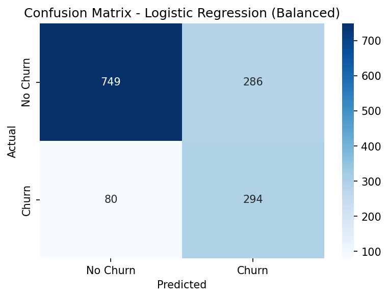

# Telco Customer Churn Prediction

Predicting customer churn for a telecom company using Logistic Regression and Random Forest, with a focus on handling real-world messy data and class imbalance.

## Problem Statement

Customer churn (customers leaving for a competitor) directly impacts revenue. This project builds a classification model to predict which customers are likely to churn, so a business could proactively target them with retention offers.

**Dataset:** [Telco Customer Churn (Kaggle)](https://www.kaggle.com/datasets/blastchar/telco-customer-churn) — 7,043 customers, 20 features covering demographics, account info, and subscribed services.

## Data Cleaning & Key Decisions

Real-world data isn't clean, and a few issues in this dataset required actual decisions, not just default fixes:

- **Hidden missing values:** `TotalCharges` was loaded as an `object` (text) column instead of numeric. Converting it revealed 11 hidden missing values that `isnull()` had missed entirely, since they were stored as blank strings, not `NaN`.
- **Root-cause investigation:** All 11 missing `TotalCharges` rows had `tenure = 0` — these were brand new customers who hadn't been billed yet. Rather than dropping these rows or imputing the mean (which would invent a false charge history), they were filled with `0`, the logically correct value.
- **Dropped `customerID`:** a unique identifier per row with no predictive value.
- **One-hot encoded** all categorical features (`drop_first=True` to avoid the dummy variable trap).
- **Stratified train/test split** to preserve the ~73/27 class ratio in both sets, since the target is imbalanced.
- **Scaled features** with `StandardScaler`, fit only on the training set to avoid data leakage into the test set.

## Class Imbalance

The target variable is imbalanced: **73% did not churn, 27% did churn.** This means a naive model predicting "no churn" for everyone would score 73% accuracy while being completely useless — so accuracy alone isn't a reliable metric here. Precision, recall, and F1 on the churn class were prioritized instead.

## Models & Results

| Metric | Logistic Regression | Random Forest | Logistic Regression (balanced) |
|---|---|---|---|
| Accuracy | 80.7% | 78.5% | 74.0% |
| Churn Precision | 0.66 | 0.62 | 0.51 |
| Churn Recall | 0.57 | 0.49 | **0.79** |
| Churn F1-score | 0.61 | 0.55 | 0.62 |

**Key insight 1 — simpler model won:** Logistic Regression outperformed Random Forest across every metric, despite Random Forest's reputation as a stronger default classifier. This is likely because churn in this dataset is driven by fairly linear relationships (e.g., month-to-month contracts, high monthly charges, and short tenure correlating strongly with churn) — a relationship Logistic Regression captures naturally without needing the added complexity of an ensemble model.

**Key insight 2 — precision/recall is a business decision, not just a metric:** Applying `class_weight='balanced'` to Logistic Regression raised churn recall from 0.57 to 0.79 (catching far more actual churners), at the cost of precision dropping from 0.66 to 0.51 (more false alarms). Which model is "better" depends on business context:
- If missing a churner is costly (lost revenue) and retention outreach is cheap → the **balanced model** is preferable, since it catches more true churners.
- If retention offers are expensive (discounts, dedicated support) → the **default model** is preferable, since it avoids wasting effort on customers who wouldn't have churned anyway.

This tradeoff, not a single "best" model, is the realistic takeaway from this project.

## Tech Stack

`Python` · `pandas` · `scikit-learn` · `matplotlib` · `seaborn` · `Jupyter Notebook`

## Future Improvements

- Hyperparameter tuning for Random Forest (`max_depth`, `min_samples_leaf`) to reduce overfitting
- Try SMOTE as an alternative to `class_weight='balanced'` for handling class imbalance
- Feature importance analysis to identify the strongest churn drivers for business recommendations
- Deploy as a simple Streamlit app for interactive predictions

## Files

- `telco_churn_prediction.ipynb` — full notebook: data cleaning, EDA, encoding, modeling, evaluation
- `WA_Fn-UseC_-Telco-Customer-Churn.csv` — dataset
- `confusion_matrix.png` — confusion matrix for the balanced Logistic Regression model
